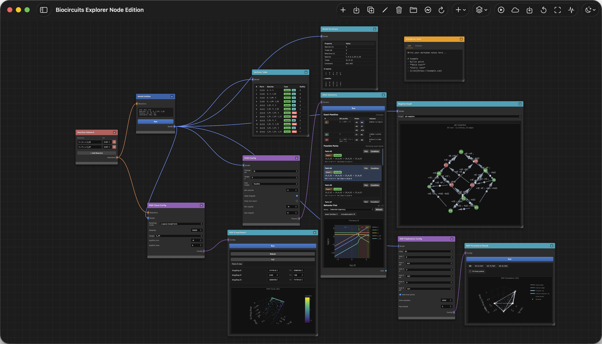

# Biocircuits Explorer

Biocircuits Explorer helps researchers see how protein-binding networks respond
when an input changes and search for networks that could produce a desired
response. A suggested network stays visibly separate from a result that the
mathematics engine has recomputed.

This page starts with the outcome: what can be run now, what has been checked,
and what remains open. Two words carry a specific meaning throughout the
repository. A **contract** states behavior that must hold. **Evidence** is the
code, test result, or versioned artifact that supports a claim.



## What is checked now

The current implementation evidence anchor is `1177a3d`. Later documentation
commits may advance the branch without changing that inspected runtime. The
earlier revision `f9c65a5` remains the historical evidence baseline for the
knowledge catalog.

- The main web application CI is configured for Julia 1.12. The checked-in
  application container also uses Julia 1.12.
- The separate headless HPC environment is configured in CI for Julia 1.10 and
  1.12. Those jobs select the matching lock file, instantiate it, and load the
  mathematics engine; they do not submit work to a scheduler.
- Browser and Python checks use Node.js 20 and Python 3.13 in CI.
- Local P6 verification passed the complete Julia backend suite, the 126 engine
  contracts, the JavaScript suite, generated-schema checks, and deployment
  contracts. This is local evidence, not a claim that a remote workflow ran.
- Synchronous heavy endpoints have a two-request process gate and explicit work
  budgets. Requests that exceed a budget return structured `422` responses;
  temporary capacity exhaustion returns `429` with `Retry-After`.
- Shared compiled models use content identity, single-flight construction, and
  per-bundle locking. Numerical scans expose convergence validity, and the UI
  renders failed points as gaps instead of treating them as scientific values.
- Raw Atlas SQLite paths over HTTP are operator-only and disabled by default;
  explicit client and server opt-in still confines them to a configured root.
- The Docker workflow is configured to build one application image, start it on
  loopback, and checks health, readiness, version reporting, the browser entry
  page, and a writable job store. It does not start the full Compose, Nginx, or
  TLS stack.
- The seven targeted macOS unit tests passed locally at `01a01be`. No
  checked-in CI job runs Xcode, so this is point-in-time local evidence rather
  than a macOS CI claim.

The configured versions and their owners are listed in the
[generated reference](knowledge/generated/reference.md#versions-and-configured-toolchains).
A configured workflow is not, by itself, proof that an external run passed.

## Quick start: local and loopback-only

Clone the repository and instantiate the Julia environment:

```bash
git clone https://github.com/YanzhangJiang/Biocircuits-Explorer.git
cd Biocircuits-Explorer
julia --project=webapp -e '
  using Pkg
  Pkg.develop(path="Bnc_julia")
  Pkg.instantiate()
'
```

Start the Julia workspace and Python Design Agent:

```bash
cd webapp
./start.sh
```

Open <http://127.0.0.1:8088>. By default, the workspace listens at
`127.0.0.1:8088` and Design Chat listens at `127.0.0.1:8765`. The Design Agent
can start without a model provider key, but a chat request returns `need_key`
until one is configured; the Julia workspace remains usable.

`webapp/start.sh` is the one checked-in launcher that intentionally permits
unauthenticated Design Chat for local development. It keeps the helper on
loopback and accepts browser requests only from the exact loopback origin of
the workspace. Do not expose this development path to a LAN or public network.

Outside that explicit development mode, helper launches fail closed unless
they have an exact loopback allowed origin and a bearer token of at least 32
characters. The macOS shell generates a new 256-bit token for every helper
launch and keeps it in process memory. Browser requests must present both that
token and the exact origin; a token-authenticated native health probe may omit
the browser origin. The model provider key and this local bearer token serve
different purposes.

To start only the Julia service on another loopback port:

```bash
BIOCIRCUITS_EXPLORER_HOST=127.0.0.1 \
BIOCIRCUITS_EXPLORER_PORT=8090 \
  julia -t auto --project=webapp webapp/server.jl
```

Useful local endpoints are:

```bash
curl http://127.0.0.1:8088/health
curl http://127.0.0.1:8088/ready
curl http://127.0.0.1:8088/metrics
curl http://127.0.0.1:8088/api/v1
```

`/api/v1/*` is the canonical API. Bare `/api/*` routes are compatibility
aliases and return an `X-API-Deprecation` header. See
[the API boundary](knowledge/contracts/api.md) and the
[generated route list](knowledge/generated/reference.md#api-routes).

## Verify a checkout

Run the standard Julia checks from the repository root:

```bash
JULIA_NUM_THREADS=auto julia --project=webapp webapp/test/runtests.jl
JULIA_NUM_THREADS=auto julia --project=webapp Bnc_julia/test/runtests.jl
julia --project=webapp webapp/test/test_phenotype_pipeline.jl
julia tests/version_resource_contract.jl
julia --project=packaging -e 'using Pkg; Pkg.instantiate()'
julia --project=packaging packaging/test_design_runtime.jl
```

Run browser, Design Agent, repository, and drift checks:

```bash
cd webapp
npm ci
npm run lint
npm run test:js
npm run test:py
npm run check-i18n-sync
cd ..
python3 -m unittest discover -s tests -p 'test_*.py' -v
python3 -m pip install -r scripts/requirements-verify.txt
python3 scripts/verify_repository.py --check
python3 -m pip install numpy
python3 webapp/scripts/reader/test_reader_nofabrication.py
```

The HPC environment check must be run once with Julia 1.10 and once with Julia
1.12. The single-image runtime smoke is
defined in [.github/workflows/docker.yml](.github/workflows/docker.yml); passing
it does not verify the full deployment stack.

## Repository map

```text
Bnc_julia/                 local BindingAndCatalysis mathematics engine
webapp/src/                Julia service, API, reusable results, and jobs
webapp/public/             browser workspace and product guide
webapp/scripts/            Python Design Agent, Reader, synthesis, migrations
webapp_hpc/                headless Julia environment with 1.10/1.12 locks
schemas/                   versioned interchange schemas
frontend-swift/            native macOS shell
packaging/                 relocatable backend-bundle builder
deploy/                    container, proxy, and optional AWS deployment tools
slurm/                     scheduler setup and submission helpers
src/periodic_table/        bounded periodic-table research primitives
scripts/periodic_table/    search and reproduction entry points
atlas_specs/               checked-in Atlas build specifications
tests/                     repository-level Python contracts
knowledge/                 maintained, evidence-linked developer knowledge
```

For a short architectural orientation, read
[PROJECT_SUMMARY.md](PROJECT_SUMMARY.md). The maintained developer knowledge
base begins at [knowledge/README.md](knowledge/README.md), and coding agents
must follow the module contracts and executable tests. Module ownership and gaps are indexed in
[knowledge/catalogs/modules.yaml](knowledge/catalogs/modules.yaml).

The browser-facing guides are
[webapp/public/wiki.html](webapp/public/wiki.html) and
[webapp/public/wiki.zh.html](webapp/public/wiki.zh.html). They are product
guides, not the source of developer contracts.

## Claims this checkout does not establish

The repository does not yet provide current evidence for:

- publishing to or pulling from a live image registry;
- image signing, signature verification, or an SBOM release lane;
- a live AWS rollout, including ECR, Batch, Cognito, S3, IAM, quota storage,
  and rollback behavior;
- submission to or completion on a real Slurm cluster;
- a signed, notarized, stapled, and Gatekeeper-tested macOS DMG;
- the complete Compose, Nginx, domain, TLS certificate, and renewal path; or
- availability or verification of any untracked research dataset.

Scripts and static tests for several of these paths exist. They reduce known
failure modes, but they are not substitutes for external runtime evidence.
Deployment details and the remaining gaps are routed through
[knowledge/modules/deployment.md](knowledge/modules/deployment.md).

## Scientific evidence boundary

- A retrieved candidate is a prior, not a verified design. Re-run it through
  the Julia engine before presenting it as computed evidence.
- Proxy scores, labels, and finite search results are not proofs of
  realizability, robustness, minimality, or impossibility.
- Scientific numbers belong in versioned artifact manifests and claim ledgers,
  not duplicated prose. Conflicting counts remain unresolved until their
  population meaning and hashes are reconciled.
- Draft manuscripts, paper figures, private feedback, and workstation material
  are not tracked here. See [knowledge/research/repositories.md](knowledge/research/repositories.md).

## Version and license

The application version is owned by `VERSION`. Update synchronized metadata
with `scripts/set_version.sh <version>`. Runtime build information is returned
by `/api/v1/version`.

Biocircuits Explorer is released under the [MIT License](LICENSE).
