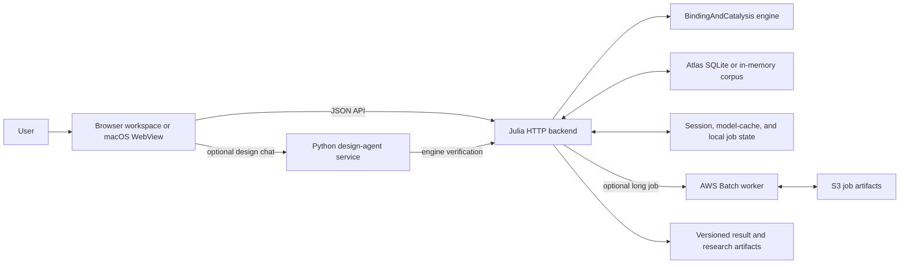

# System architecture

Biocircuits Explorer turns a binding-network description into inspectable model
structure, response calculations, reaction-order paths, atlas matches, and
design recommendations. The important boundary is simple: an interface may ask
for a behavior, but only a validated request followed by an engine-backed result
or an explicitly graded certificate is evidence that the behavior is available.

Two terms carry most of the architecture:

- **reaction order (ROP)** describes how an output changes with a chosen input
  inside an asymptotic regime;
- the **behavior atlas** stores reusable network/input/output summaries and
  witnesses derived from those regime paths.

Everything else should be read in terms of where the request is validated and
what evidence the response actually contains.

At the current verified revision, ordinary HTTP computation is deliberately
bounded. Known large or cancellable work belongs to the jobs surface. Static
cost checks reject oversized synchronous requests before expensive work starts;
path-expansion limits stop materialization before it crosses its allocation
ceiling. Failed solver points remain explicit invalid/partial evidence and
cannot be plotted or promoted as successful designs.

## Component map

The browser workspace is served from [`webapp/public/`](../../webapp/public/).
The native shell supervises the same web assets and backend rather than owning a
second analysis implementation; its launch contract lives in
[`BiocircuitsBackendController.swift`](../../frontend-swift/BiocircuitsExplorerMac/BiocircuitsBackendController.swift).
The optional Python chat process is a sibling, not a replacement engine: its
[`engine_client.py`](../../webapp/scripts/engine_client.py) calls the Julia API
and returns an explicit offline/error result when computation is unavailable.

## Layers and owners

| Layer | Decides | Canonical owners |
|---|---|---|
| Interface | workspace state, visualization, request assembly | [`webapp/public/js/`](../../webapp/public/js/), [`frontend-swift/`](../../frontend-swift/) |
| API/runtime | routing, validation, sessions, jobs, auth, persistence | [`webapp/src/`](../../webapp/src/), [backend runtime card](../modules/backend-runtime.md) |
| Mathematical engine | binding-network regimes, ROP geometry, SISO paths, numerical solves | [`Bnc_julia/src/`](../../Bnc_julia/src/), [engine card](../modules/engine-rop.md) |
| Reusable behavior knowledge | network enumeration, behavior slices, querying, inverse design | [`atlas.jl`](../../webapp/src/atlas.jl), [`atlas_sqlite.jl`](../../webapp/src/atlas_sqlite.jl), [atlas card](../modules/atlas.md) |
| Recommendation evidence | explicit target audit, feasible regions, sampled forward checks | [`designability.jl`](../../webapp/src/designability.jl), [designability card](../modules/designability.md) |
| Research products | periodic-table runs, reduced extracts, notebooks, paper-facing outputs | [`src/periodic_table/`](../../src/periodic_table/), [`scripts/periodic_table/`](../../scripts/periodic_table/), [`paper_rop_periodic_table/`](../../paper_rop_periodic_table/) |

## Trust boundaries

1. **Client input is untrusted.** HTTP bodies, imported SBML, legacy payloads,
   natural-language output, environment configuration, and externally stored
   artifacts must be parsed or validated before they influence an engine call.
   The typed IR and schema surfaces are indexed in
   [data provenance](data-provenance.md).
2. **The Python design agent is advisory.** Optional LLM output and catalogue
   lookup can propose work, but verified quantities come from the Julia engine
   or a named certificate. The Reader's unavailable-corpus and prior-label
   behavior is regression-tested by
   [`test_reader_nofabrication.py`](../../webapp/scripts/reader/test_reader_nofabrication.py);
   the Agent's stronger fresh-compute/card-admission boundary is owned by
   [`design_agent.py`](../../webapp/scripts/design_agent.py) and has only focused,
   mocked contract coverage rather than a live end-to-end proof.
3. **Local process state is not artifact truth.** Sessions and compiled models
   are bounded caches. Content identity selects a compiled model; session IDs
   are aliases. Per-bundle locks protect lazy mutable engine state, while
   single-flight construction prevents split bundles for one hash. Job
   `record.json` is the canonical process-restart record; its
   public `status.json` is a best-effort projection. Atlas SQLite and S3 cross
   process boundaries and therefore require schema, identity, and ownership
   checks.
4. **Filesystem paths are operator authority.** Raw Atlas SQLite paths are
   disabled on HTTP by default. Explicit client and server opt-in still limits
   them to a configured store root; this is a trusted-operator mode, not a
   multi-tenant path API.
5. **Cloud execution is a separate trust zone.** The broker verifies identity
   when Cognito is configured, partitions jobs by user, and transfers explicit
   input/status/result artifacts. AWS command success alone is not proof of a
   result; the jobs code also checks for the result artifact.
6. **Research prose is downstream.** A notebook, figure, or manuscript statement
   is not a runtime contract. It should cite the exact data artifact, generator,
   code revision, and verification command that support it.

## Current and compatibility surfaces

There are two different uses of “legacy,” and they must not be conflated:

- **HTTP surface:** `/api/v1/...` is the canonical current API. Bare
  `/api/...` endpoints are compatibility aliases routed to the same handlers
  and carry an `X-API-Deprecation` header. The current browser client still
  constructs bare `/api/...` URLs in
  [`api.js`](../../webapp/public/js/api.js), so removing the aliases requires a
  coordinated client migration.
- **model payload:** `NetworkIR` (`bne-ir/v1.0.0`) is the versioned model contract.
  Legacy `{reactions, kd}` requests are still accepted and translated by
  [`ir.jl`](../../webapp/src/ir.jl). They are an input bridge, not a second
  mathematical model.

Versioned result envelopes are additive: existing response fields remain in
place while an `artifact` sibling records input hashes, algorithm/config
identity, warnings, and creation time. See
[`result_artifact.jl`](../../webapp/src/result_artifact.jl).

## Reading order for a change

Start with this page, then read [runtime](runtime.md) for the process path and
[data provenance](data-provenance.md) for evidence strength. Follow the module
card for the code you will touch. A change that crosses modules must preserve
both sides of the boundary; a passing local helper test is not sufficient
evidence for a changed API, persisted artifact, or scientific claim.
